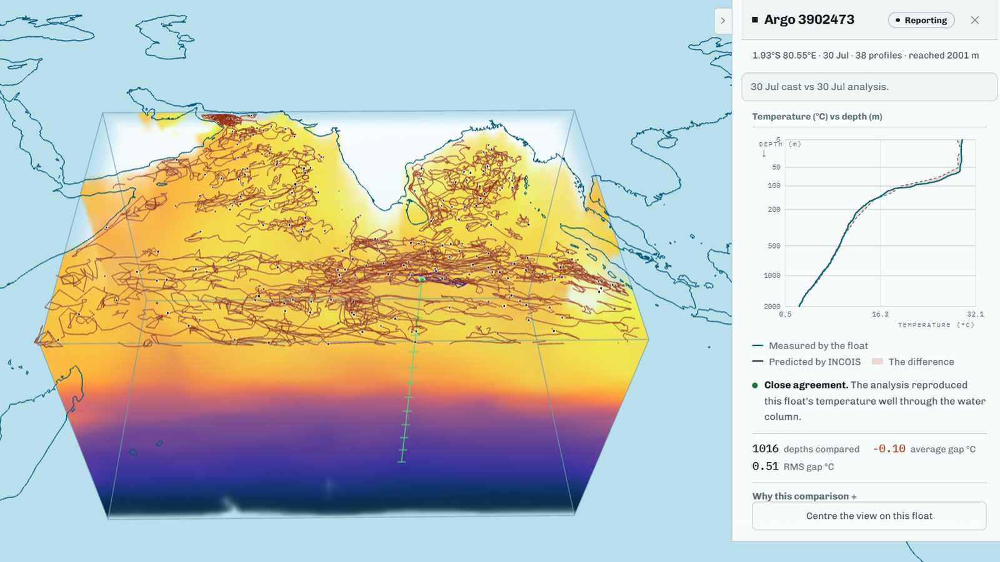
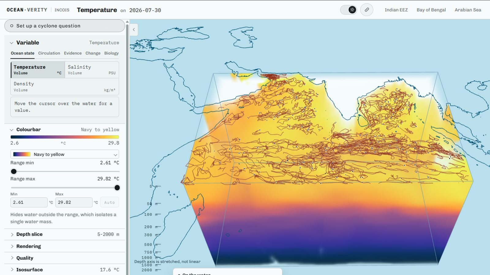
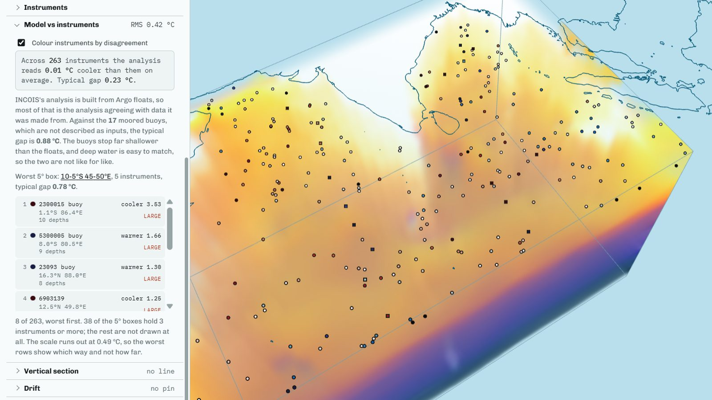
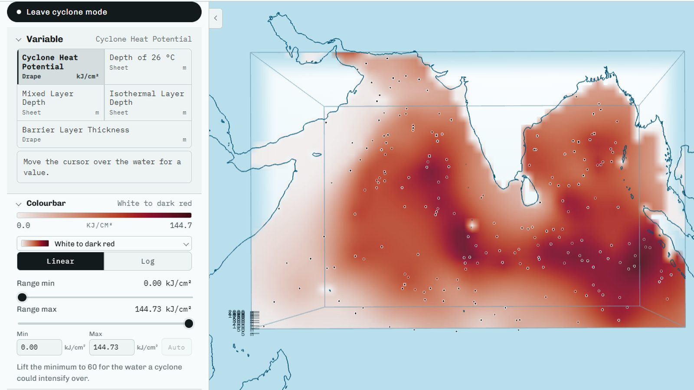
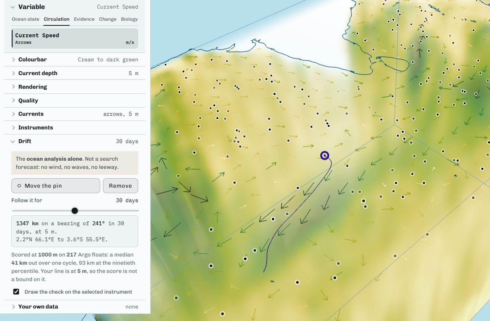
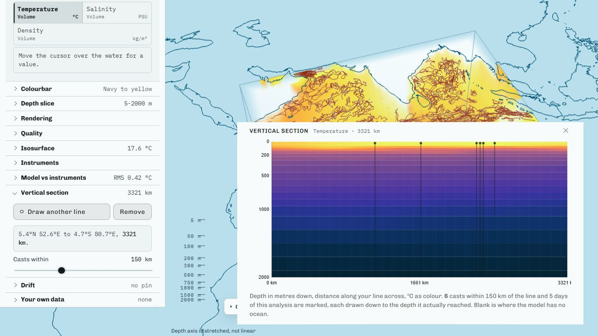

<div align="center">

# Samudra 3D

**Fly into the Indian Ocean and see, in one picture, what the model predicted
and what the instruments in the water actually measured.**

[](https://rak2315.github.io/samudra-sih26/app.html)
[](https://rak2315.github.io/samudra-sih26/)
[](https://rak2315.github.io/samudra-sih26/provenance.html)

Smart India Hackathon 2026 &middot; Problem Statement **26067** &middot; MoES / INCOIS
&middot; Software &middot; Disaster Management &middot; Team Sigmoid




*One frame, and the whole argument. INCOIS's 30 July 2026 analysis as a block of water you fly
into, the floats drawn where they actually were, and one float's cast scored against the model:
**54 depths compared, 0.08 °C average gap, "moderate disagreement"**.*

</div>

---

## The problem

India runs an ocean model. India also has robot floats drifting in that same water taking real
measurements. **You cannot currently look at the two together.** The model lives in one desktop
program, the measurements in another, and both draw flat maps one depth at a time. So the
question a forecaster actually has - *is the model right, here, at this depth, today?* - has no
tool behind it.

PS 26067 asks for a 3D visualisation of INCOIS's ocean data. We read that as: **the picture is
not the deliverable. The comparison is.**

## What we built

A website that draws the ocean as a solid block of water you fly inside, from 5 m to 2000 m,
with the instruments sitting in it where they actually were. Click one and it tells you what it
measured against what the model predicted at the same place on the same day, and **puts a number
on how far apart they were** - whichever way that number comes out.

It opens in a browser, needs no account, and **makes zero network calls at demo time.** A dead
venue network cannot kill it.

| | |
| --- | --- |
| **Live** | [Landing page](https://rak2315.github.io/samudra-sih26/) &middot; [The platform](https://rak2315.github.io/samudra-sih26/app.html) |
| **Every figure, sourced** | [provenance.html](https://rak2315.github.io/samudra-sih26/provenance.html) |
| **Every PS clause, answered** | [requirements.html](https://rak2315.github.io/samudra-sih26/requirements.html) - each clause links straight to the control that answers it |
| **Prototype video** | [Watch on Google Drive](https://drive.google.com/file/d/1LTY8K1G6kZmPgNEslfE59tnTUSqkIc29/view). Recorded before these were built, so they are not in it: the Cyclone Montha walkthrough, the cyclone fields checked against INCOIS's own archive, the redesigned requirements and provenance pages, the Biology variables (chlorophyll, dissolved oxygen, the oxygen floor and surface fronts) with their fishing walkthrough, and the tour pausing instead of closing when you touch a control. |

---

## What makes it different

**1. It publishes its own error.** Most visualisations show you the model and stop. This one
scores the model against every instrument in the water and prints the result, including where it
looks bad.

> Across **263 instruments** the typical gap is **0.23 °C**. But INCOIS's gridded Argo analysis
> is built from these floats, so a float's agreement is largely the analysis agreeing with data it
> was made from. The **17 moored buoys** are not described as inputs, which makes them the closer
> thing to an independent check. They read **0.88 °C** against **0.18 °C** for floats - but floats are compared down to
> about 2000 m and buoys only to 500 m, and deep water is easy to match, so the two are not like
> for like and we do not quote a ratio. We print both, separately, because pooling them would
> flatter the model.

**2. Never answer a scientific question from the picture.** The rendered block is quantised to a
byte per value and warped for the GPU. Every number a user reads - tooltips, comparisons, API
responses - comes from the full-precision grid instead. This one rule shapes the whole
architecture.

**3. A gap is drawn as a gap.** Where nobody measured, we say so rather than colouring it in.
**10.2%** of the block has no observation behind it, and there is a variable whose only job is to
show you where.

**4. It has a second door.** Nineteen variables is right for a forecaster and wrong for a school
group, so `Explore` turns the platform into eight plain questions, and `?kiosk=1` runs it
unattended on an exhibition screen.

---

## The numbers

Every figure below is read off the running build by
[`pipeline/scripts/collect_facts.py`](pipeline/scripts/collect_facts.py). Nothing is typed by
hand.

| | |
| --- | --- |
| Instruments in the water | **274** - 257 Argo floats + 17 moored buoys |
| Variables | **19**, in 6 groups; 4 published by INCOIS, 2 by Copernicus Marine, 13 computed here |
| Analyses | **36** timesteps, 10 Aug 2025 to 30 Jul 2026, over 45-100 °E and 10 °S-25 °N |
| Depth | **5 m to 2000 m** across 24 uneven levels |
| Data shipped in the build | **223 MB**, committed, **0** network calls to run |
| Source adapters | **11** - 10 providers, plus one for a file a visitor drops on the page |
| Tests / browser probes | **495** / **16** |
| Drift model, scored | median **41.0 km** out over one Argo cycle, across 6,185 cycles on 217 floats |
| Plankton and oxygen, scored | Copernicus's model against **55** floats for chlorophyll and **40** for oxygen: oxygen reads **8.14 mmol/m³** high on average |

## What it looks like

| | |
| --- | --- |
|  |  |
| **The water column.** The whole depth as one body, not a stack of slices. | **Where the model is wrong.** Every instrument coloured by its own disagreement. |
|  |  |
| **Cyclone mode.** One press swaps in the five things a cyclone forecaster asks for. | **Drift.** Drop a pin, follow the current. The model publishes its own median error. |
|  |  |
| **Vertical section.** Draw a line, cut the ocean along it. | **Exhibition mode.** The same platform, for a room full of students. |

*Every picture is the running build. Nothing is a mockup and nothing is retouched.*

---

## Architecture

**It is a fork, not a pipeline.** That is the one thing worth understanding, and it exists to
enforce the rule above.

**Eleven providers → one adapter seam → one Grid → four ways out.** The fork is at step 3, and
it is the whole of the rule above: the Grid keeps the numbers, the Volume gets the pixels, and
nothing joins them back up.

```
  ┌─ 1 · ELEVEN PROVIDERS - public, dated, re-fetchable ──────────────────┐
  │ INCOIS ERDDAP · VAM           Argo GDAC · Ifremer                     │
  │ INCOIS ERDDAP · McCreary      Argo BGC · chlorophyll, oxygen          │
  │ NOAA OSMC · moored buoys      Copernicus Marine · uo, vo              │
  │ EGO glider GDAC               Copernicus Marine · chl, o2 model       │
  │ World Ocean Atlas 2023        Copernicus Marine · satellite SST, chl  │
  │ your own NetCDF file, dropped on the page                             │
  └──────────────────────────────┬────────────────────────────────────────┘
                                 │  NetCDF · CSV · FTP index
                                 │  subset at the server, not after download
                                 ▼
  ┌─ 2 · ONE ADAPTER SEAM - samudra/sources/base.py ──────────────────────┐
  │ GridSource / ProfileSource · eleven classes                           │
  │ the only code in the project that has heard of ERDDAP                 │
  │ quality control per channel · land masked, never filled               │
  └──────────────────────────────┬────────────────────────────────────────┘
                                 │  Grid and Profile objects,
                                 │  on the provider's own axes
                                 ▼
  ╔═ 3 · THE GRID - the scientific truth ═════════════════════════════════╗
  ║ float64 · land is NaN · 24 levels · 56 x 36 · 1 degree                ║
  ║ every collocation, tooltip, section, API response and served          ║
  ║ byte is read from here                                                ║
  ╚═════════════╤══════════════════════════════╤══════════════════════════╝
                │                              │
                │ numbers,                     │ the BAKE: quantise to
                │ unchanged                    │ 4 bytes, warp the depth axis
                │                              ▼
                │                ┌─ ─ ─ ─ ─ ─ ─  THE VOLUME ─ ─ ─ ─ ─ ─ ─ ┐
                │                │ 56 x 36 x 48 · 1 byte a value          │
                │                │ value · coverage · gradient · spare    │
                │                │ a picture for the GPU, and a dead      │
                │                │ end for numbers                        │
                │                └─ ─ ─ ─ ─ ─ ─┬─ ─ ─ ─ ─ ─ ─ ─ ─ ─ ─ ─ ─ ┘
                │                              │  pixels only,
                │                              │  never a reading
                ▼                              ▼
  ┌─ 4 · FOUR WAYS OUT ───────────────────────────────────────────────────┐
  │ REST API         Grid only   FastAPI · 21 routes                      │
  │ Open standards   Grid only   OPeNDAP · CF-1.8 · WMS 1.3.0             │
  │ Static bake      both        223 MB committed · 0 network calls       │
  │ Browser          both        reads the bake, never the API            │
  └───────────────────────────────────────────────────────────────────────┘
```

### 1 · The providers, in full

Each one public, each tested and dated in
[`docs/plan/00-data-sources-verified.md`](docs/plan/00-data-sources-verified.md).

| Provider | What it gives us |
| --- | --- |
| **INCOIS ERDDAP** `incois_argo_10d_VAM` | The 10-day gridded analysis - temperature and salinity |
| **INCOIS ERDDAP** 10-day McCreary | The second analysis, for the spread between them |
| **Argo GDAC** · Ifremer | Float profiles, with per-channel QC flags |
| **Argo BGC** · Ifremer | Chlorophyll on 57 of the floats and oxygen on 40, compared against the Copernicus model |
| **NOAA OSMC** | Moored buoys over GTS - **not described as inputs to INCOIS's Argo analysis** |
| **Copernicus Marine** | Current vectors `uo`, `vo` at 1/12° |
| **Copernicus Marine** biogeochemistry | Chlorophyll and dissolved oxygen at 0.25°, and the oxygen floor cut from it |
| **Copernicus Marine** satellite | OSTIA sea surface temperature and gap-free chlorophyll, for surface fronts (never called fishing zones) |
| **EGO glider GDAC** · `ftp.ifremer.fr` | The glider archive PS 26067 names |
| **World Ocean Atlas 2023** · NOAA NCEI | The 1991-2020 climatological normal |
| **Your own NetCDF file**, dropped on the page | The eleventh adapter, `POST /api/netcdf` |

### 2 · What the seam actually is

[`samudra/sources/base.py`](pipeline/samudra/sources/base.py) declares `GridSource` and
`ProfileSource` and nothing else. Eleven classes implement them, and **they are the only code in
the project that has ever heard of ERDDAP**, or of a column layout, or of an FTP index. Each
subsets *at the server*, so one region and one window come down rather than a global archive.

The claim that this is a seam rather than a wish was tested by the September 2026 round, which
added **four providers** - INCOIS's second analysis, Copernicus Marine, the EGO glider archive
and the World Ocean Atlas - and **touched no renderer, no endpoint and no UI file.**

### 3 · Why there are two representations, and only one is the truth

The **Grid** is `time × depth × lat × lon` in float64 on INCOIS's own 1° mesh, with land left as
`NaN`. It is what every collocation, tooltip, vertical section, API response and served byte is
read from.

The **Volume** is what a GPU can sample: the same field resampled onto an evenly spaced lattice,
quantised to one byte a value, with the depth axis warped so the upper ocean gets more of it,
and back-filled across land so the ray marcher does not tear at the coast. Every one of those
four steps is a lie a shader needs and a scientist must never be told. So the Volume is a **dead
end**: it is written by the bake, read by the shader, and nothing reads a value back out of it.

### 4 · Four ways out

| Out | Reads from | What it is |
| --- | --- | --- |
| **Static bake** | Grid **and** Volume | 223 MB committed · **0 network calls** |
| **Browser** | Grid **and** Volume | Three.js · WebGL2 · GLSL ES 3.00 |
| **REST API** | **Grid only** | FastAPI · 21 routes |
| **Open standards** | **Grid only** | OPeNDAP DAP2 · CF-1.8 · WMS 1.3.0 · 5 endpoints |

> ### The rule the shape is drawn to show
>
> **Every number a human or a machine reads comes from the Grid. The Volume's only arrow goes to
> the screen.** This matters most at the API, because a consumer pulling NetCDF over the wire
> cannot see that they have been handed a quantised, depth-warped approximation.
>
> **Two modules break the one-copy rule, and both are held to it.** The drift integrator and the
> vertical section run in the browser as well as in Python, because the demo runs with the API off.
> A probe runs the shipped browser module against the pipeline's and fails on disagreement.
> Measured: drift median **0.331 km** over 101 days; section worst gap **5.07e-5 °C** over 1,102
> values.

### Three layers, and what separates them

| Layer | Responsible for | The seam below it |
| --- | --- | --- |
| **`pipeline/`** · Python | Reading every provider, quality-controlling every observation, computing every derived variable, writing the bake. **All tested logic lives here** - 495 tests. | `samudra/sources/base.py`. A provider is one class. Nothing above this file knows a provider exists. |
| **`api/`** · FastAPI | What a static folder cannot answer: an arbitrary column, an arbitrary section line, an uploaded NetCDF file. Also serves OPeNDAP, CF-1.8 NetCDF and OGC WMS. | `data/grids/*.npz`. **Every endpoint reads the `Grid`. None can reach a `Volume`.** |
| **`web/`** · React + TypeScript + Three.js | One WebGL scene for globe and volume, every control and panel, and the two pieces of science that must run offline. | `web/public/data/`. The browser reads **files, not endpoints** - the only exception is a file the user drops. |

They are genuinely separable: the pipeline runs with no browser, the browser runs with no API.
That is not tidiness - it is why the demo survives a dead network, and why the public deployment
works with no server behind it at all.

### The data path

1. **Provider** - eleven adapters, ten of them public endpoints and the last a file a
   visitor drops on the page. Each tested and dated in
   [`docs/plan/00-data-sources-verified.md`](docs/plan/00-data-sources-verified.md).
2. **Adapter** - one class per provider, subsetting *at the server* so we pull one region and one
   window. Argo's own QC flags are read per channel, then a regional salinity floor catches what
   the global standard lets past. Land is masked, never filled.
3. **Grid** - `time × depth × lat × lon`, float64, on INCOIS's own mesh. **The scientific truth.**
4. **Derived variables** - density, cyclone heat potential, mixed layer depth and ten more,
   each computed here and each held to a hand-computable test.
5. **Bake** - the `Volume` for the GPU, plus float32 grids, float positions, collocations,
   residuals and the drift check. 223 MB, committed.
6. **Browser** - reads those files. No network.

---

## Tech stack

| Layer | What | Why this one |
| --- | --- | --- |
| **Science** | Python 3.10+, NumPy, xarray, netCDF4, gsw (TEOS-10) | `gsw` is the international standard for seawater density, so our derived Field is the one an oceanographer would compute. |
| **Colour** | cmocean | Perceptually uniform, and each scale is designed for a specific ocean quantity. A rainbow palette invents fronts that are not in the data. |
| **Data access** | ERDDAP / OPeNDAP over `requests`, `pydap` | INCOIS and Argo both publish ERDDAP, so no scraping and no private endpoint. |
| **API** | FastAPI + `uvicorn` | Serves the queries a static bundle cannot precompute, and the three open standards below. |
| **Standards out** | OPeNDAP (DAP2), CF-1.8 NetCDF, OGC WMS 1.3.0 | So the analysis is readable by a Python client, a file, or a GIS - not only by this page. |
| **Rendering** | Three.js on WebGL2, GLSL ray marching | The volume is a single ray-marched block, not a stack of images. Nothing else gets you inside the water. |
| **Frontend** | React 18, TypeScript 5, Zustand, Vite | Zustand because every control is one flat store the scene reads once a frame; Vite for a four-page build with no config. |
| **Verification** | pytest, Playwright | 495 tests on the science; 16 Playwright probes that **measure the rendered page**, because every bad bug here looked like a shader bug and was not. |
| **Fonts** | Chivo, IBM Plex Mono, Space Grotesk, Inter - all self-hosted | The demo makes zero network calls. A Google Fonts link is a build failure, not a style choice. |

---

## Run it

**Prerequisites:** Python **3.10+**, Node **18+**, and a browser with WebGL2 (any current one).
No account, no API key, no database.

```bash
git clone https://github.com/RAK2315/samudra-sih26 && cd samudra-sih26

# 1. install
python -m venv .venv
.venv/Scripts/pip install -r pipeline/requirements.txt      # Windows
# .venv/bin/pip install -r pipeline/requirements.txt        # macOS / Linux
cd web && npm install && cd ..

# 2. run the website
cd web && npm run dev                                       # http://localhost:5173
```

**That is the whole setup.** The baked data is committed, so the platform runs offline from a
fresh clone. The two steps below are optional.

```bash
# optional: the REST API and the three open standards
.venv/Scripts/python -m uvicorn api.main:app --port 8000    # /docs for the OpenAPI page

# optional: rebuild the data from source (a few minutes; needs one free Copernicus account
# for the current velocities, and nothing else)
cd pipeline && ../.venv/Scripts/python -m samudra.bake
```

### Check the claims yourself

Nothing in this README is asserted without something that can fail:

```bash
cd pipeline && ../.venv/Scripts/python -m pytest -q         # 495 tests, ~35 s
cd web && npm run typecheck && npx vite build

# the 16 browser probes measure the rendered page rather than trusting it.
# They need a preview server; each takes a minute or two.
cd web && npx vite preview --port 4173 &
node probe-guide.mjs        # every control is explained, every figure came from the bake
node probe-controls.mjs     # six rules per Field, checked rather than eyeballed
node probe-palette.mjs      # the colourbar switcher, and that the water and legend agree
node probe-drift.mjs        # the browser's integrator against the pipeline's, in kilometres
node probe-landing.mjs      # no external request, and the hero's contrast in both themes
node probe-chrome.mjs       # every text role in the console, in both themes
```

`probe-section.mjs` and `probe-upload.mjs` additionally need the API on port 8000; the rest do
not.

---

## Where to look

| | |
| --- | --- |
| [`CONTEXT.md`](CONTEXT.md) | Domain vocabulary and the scope cut line. **Read first.** |
| [`docs/adr/`](docs/adr/) | Eighteen decision records, several documenting traps that cost hours. |
| [`docs/README-full.md`](docs/README-full.md) | The long-form version of this file: every clause of the PS answered, every variable explained, the full architecture. |
| [`docs/BUGS.md`](docs/BUGS.md) | A public defect list. 100 fixed, 2 open by design. |
| [`docs/plan/`](docs/plan/) | Every endpoint tested including the dead ones; the requirement gaps and the decision on each. |
| [`ppt/`](ppt/) | The deck, the video script, and every figure they may quote. |

## What we deliberately did not build

Saying no is part of the design.

- **Geostrophic current speed.** Prototyped and rejected: it reported 0.16 m/s for the Somali
  Current against a real 1.5-2.5 m/s. Finite and plausible-looking is not the bar. (ADR 0010)
- **3-D particle advection.** Vertical velocity exists here only as model output
  (Copernicus `wo`), never measured, so a 3-D particle would claim a motion no one measured. The flow is drawn on one level instead. (ADR 0017)
- **A palette chooser.** A palette belongs to a variable, not to a dropdown. (ADR 0010)
- **Login, upload storage, write access.** The platform is read-only. The one endpoint that
  accepts anything holds it in memory and stores nothing.

---

## Data credits

Argo data are collected and made freely available by the International Argo Program and the
national programmes that contribute to it. The Argo Program is part of the Global Ocean Observing
System. Gridded analysis products are produced by the **Indian National Centre for Ocean
Information Services (INCOIS)**, Ministry of Earth Sciences, Government of India. Current
velocity is **E.U. Copernicus Marine Service Information**. Climatology is **NOAA World Ocean
Atlas 2023**. Moored buoy observations via **NOAA OSMC**. Colour scales are **cmocean** (Thyng et
al., 2016). Coastlines are **Natural Earth**.
